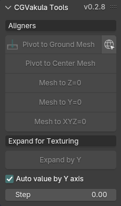
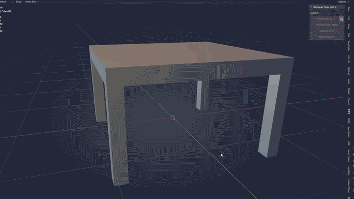
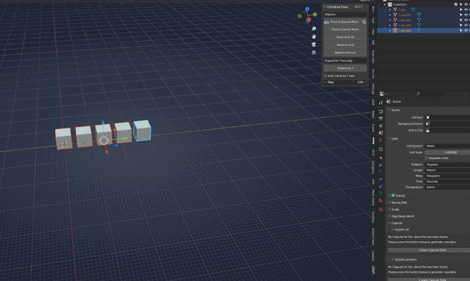

<h1 align="center">CGVakula Tools</h1>

<h3 align="center">
  Небольшой аддон для улучшения рабочего процесса.
</h3>

 

## 💻 Совместим с Blender ✨v2.93 - 4.1✨

<h3 align="center">Функционал</h3>

#### 🚀 Работа с pivot point
- 🧩 Точка опоры по нижней границе меша.
- 🧩 Точка опоры в центр массы
- 🧩 Меш в 0 по оси Z
- 🧩 Меш в 0 точку мира.

  

#### 🚀 Разброс моделей для текстурирования
- 🧩 Контролируемый или автоматический разброс мешей по оси Y. Удобно, когда нужно быстро раскидать составные части модели для текстурирования или запекания.

- 🧩 Распределение мешей на равные промежутки по оси Y, между двумя объектами

✨А, ещё там есть кнопочка на мой ютуб канал, чтобы можно было сразу посмотреть пару уроков))✨

🎉 Пробуйте, пишите Ваши идеи и пожелания. Со временем буду наращивать функционал.

## ✨ Мой блог: https://t.me/cgvakula
  

